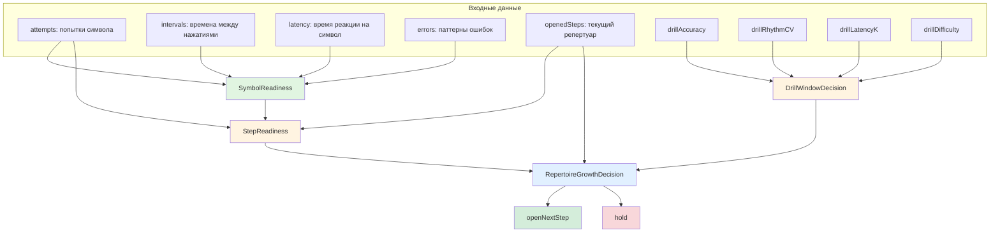

# Методология открытия движений в FlowTyping

Исследование подходов к прогрессивному усложнению моторной нагрузки при обучении слепой печати и рекомендации по построению `KeyLadder`, метрикам готовности и формализации правил перехода.

---

## 1. Аннотация

**Цель** — определить, как эффективно повышать моторную нагрузку в тренажёре FlowTyping, какие триггеры и маркеры сигнализируют о готовности к переходу на следующую ступень, и как формализовать эти решения в виде DMN-правил.

**Задачи документа:**
- Обзор теории моторного обучения и существующих практик обучения слепой печати.
- Сравнение стратегий открытия клавиш (всё сразу, по рядам, по пальцам, по частотности).
- Предложения по составу `KeyLadder` для раскладок qwerty, йцукен и программистских символов.
- Анализ метрик процесса набора и их влияния на решение о переходе.
- Формализованные DMN-правила перехода между ступенями.
- Применение к архитектуре FlowTyping (`Auto-Flow`, `Skill Profile`, `Repertoire`).

---

## 2. Теоретические основы

### 2.1. Моторное обучение и когнитивная нагрузка

Слепая печать — это **моторный навык дискретного типа**: каждое нажатие — отдельное движение, но в потоке они объединяются в последовательности. Формирование навыка проходит через несколько фаз:

1. **Когнитивная фаза** — учащийся сознательно вспоминает расположение клавиши и выбирает палец.
2. **Ассоциативная фаза** — движения становятся более плавными, снижается количество ошибок.
3. **Автономная фаза** — нажатия выполняются без сознательного контроля, «мысль о символе → движение пальца».

С точки зрения **теории когнитивной нагрузки** (Sweller et al., 1998; Paas & Sweller, 2012), новичок одновременно должен:
- держать в рабочей памяти расположение клавиш;
- контролировать положение пальцев;
- читать текст/символы;
- координировать два полушария и десять пальцев.

Каждый новый элемент увеличивает **внутреннюю когнитивную нагрузку**. Если нагрузка превышает ёмкость рабочей памяти (≈ 4±1 объекта), обучение замедляется, а ошибки растут. Поэтому клавиши нельзя открывать все сразу: даже опытные самоучки, знающие раскладку визуально, не справляются с моторной координацией при полной нагрузке.

**Human movement effect** (Paas et al., 2012) показывает, что наблюдение и имитация человеческих движений снижают когнитивную нагрузку при обучении моторным задачам. В FlowTyping это реализовано через «визуализацию движения» — интерфейс показывает путь пальца, а не просто целевую клавишу.

### 2.2. Принципы прогрессивного усложнения

Из теории моторного обучения вытекают ключевые принципы:

| Принцип | Пояснение | Применение в FlowTyping |
|---------|-----------|-------------------------|
| **Чанкинг** | Объединение элементов в осмысленные блоки | Группировка клавиш по пальцам/рядам, а не по отдельности |
| **Принцип близости переноса** | Тренировать движения, близкие к целевым | Начинать с домашнего ряда — он служит якорем для всех остальных |
| **Переменная практика** | Разнообразие условий улучшает перенос | После освоения клавиши в изоляции — смешивать с уже известными |
| **Частотное закрепление** | Частые символы нуждаются в меньшем сознательном контроле | Указательные и частые буквы можно открывать раньше |
| **Ограничение скорости** | Скорость растёт из точности, а не наоборот | Пороги перехода опираются на точность и ритм, не на wpm |

### 2.3. Точность, скорость и ритм

Существует консенсус в педагогике слепой печати: **точность важнее скорости**. Это соответствует и теории моторного обучения: ошибки, повторённые многократно, закрепляют неправильный моторный паттерн («практика делает постоянным»).

**Ритм** — второй критичный сигнал. Ровные интервалы между нажатиями указывают на автоматизм; скачки — на поиск клавиши, когнитивную перегрузку или неуверенность. Важно: ритм индивидуален (зависит от физиологии, темперамента, клавиатуры), поэтому его нельзя оценивать абсолютно — только относительно собственной медианы пользователя.

**Латентность** (время реакции на символ) — надёжный индикатор сложности движения. Растёт на незнакомых/трудных клавишах и биграммах. Как и ритм, значима относительно собственной медианы.

---

## 3. Обзор практик открытия клавиш

### 3.1. Стратегия «всё сразу»

Пользователь видит все клавиши и печатает реальные тексты. Поддерживается интуитивно: «чем больше практикуешь, тем лучше».

**Проблемы:**
- Новые символы конкурируют за внимание; ошибки распространяются на соседние позиции.
- Невозможно отличить слабость конкретного движения от общей перегрузки.
- Высокий риск формирования компенсаторной техники (например, игнорирование мизинцев).

**Вывод:** не подходит для начального обучения, но применима на этапе «свободной практики» после освоения базы.

### 3.2. Стратегия «по рядам»

Классический подход: домашний ряд → верхний ряд → нижний ряд → цифры → символы.

**Примеры:** TypingClub Typing Jungle, Typing.com, How-To-Type.com.

| Этап | Клавиши | Обоснование |
|------|---------|-------------|
| Домашний ряд | `asdf jkl;` / `фыва олдж` | Якорь для всех пальцев, минимум движений |
| Верхний ряд | `qwertyuiop` / `йцукенгшщзхъ` | Частые буквы (e, t, o, u, i), естественное продолжение домашнего |
| Нижний ряд | `zxcvbnm` / `ячсмитьбю` | Менее частые буквы, максимальное растяжение мизинцев |
| Цифры/символы | `123...`, `!@#...` | Требуют дополнительного слоя (Shift) или нового ряда |

**Плюсы:**
- Простая ментальная модель «якорь → верх → низ → цифры».
- Легко объяснить пользователю.
- Хорошо работает для классного обучения.

**Минусы:**
- Игнорирует разницу в силе пальцев: мизинцы и безымянные получают равную нагрузку с указательными.
- Верхний ряд содержит очень частые буквы, а нижний — редкие; равномерность по рядам ≠ равномерность по сложности.
- Не учитывает персональные слабости.

### 3.3. Стратегия «по пальцам»

Клавиши открываются в порядке пальцев: указательные → средние → безымянные → мизинцы. Каждый палец покрывает свою «зону» (домашний + верхний + нижний ряд).

**Примеры:** University of Waterloo Touch Typing Tutorial, Typesy, KeyBlaze.

| Палец | Зона (qwerty) | Зона (йцукен) |
|-------|---------------|---------------|
| Указательные (L2/R2) | `fg rt vb` / `пр ке мить` + `hj yu nm` / `ро не тьб` | Самые сильные, покрывают больше всего клавиш |
| Средние (L3/R3) | `edc` / `всм` + `ik,` / `шлб` | Средняя сила и гибкость |
| Безымянные (L4/R4) | `wsx` / `ычс` + `ol.` / `щдю` | Слабее, связаны общими сухожилиями |
| Мизинцы (L5/R5) | `qaz` / `яфя` + `p;/?` / `зжэ.` | Наименее сильные и гибкие |

**Плюсы:**
- Соответствует биомеханике руки: сильные пальцы тренируются первыми.
- Позволяет сразу освоить полный вертикальный диапазон движения пальца.
- Уменьшает перекрёстное влияние между пальцами.

**Минусы:**
- Требует больше шагов.
- Слова на ранних этапах могут быть ненатуральными.
- Нужен адаптивный подбор, чтобы не застрять на редких комбинациях.

### 3.4. Стратегия «по частотности»

Клавиши открываются в порядке частоты использования в языке. Например, Keybr начинает с `e, t, a, o, i, n...` и постепенно добавляет редкие буквы.

**Плюсы:**
- Максимальная практическая ценность с первых шагов.
- Хорошо работает для взрослых, уже знающих раскладку визуально.
- Позволяет быстрее печатать «настоящие» слова.

**Минусы:**
- Частые буквы могут оказаться на разных пальцах и рядах, что повышает когнитивную нагрузку новичка.
- Не формирует целостную моторную схему пальца.
- Может привести к тому, что слабые пальцы открываются слишком поздно.

**Вывод:** частотность — отличный критерий для адаптивной подачи *внутри* уже открытых групп, но плохой основной принцип для первичного обучения технике.

### 3.5. Гибридный подход

Наиболее перспективная стратегия для FlowTyping — **геометрически-пальцевая основа с частотной и адаптивной доводкой**:

1. **Ступени KeyLadder строятся по пальцам/зонам** — это задаёт правильную технику и биомеханически обоснованный порядок.
2. **Внутри ступени упражнения подбираются с учётом частотности** — чтобы тексты были осмысленными.
3. **Адаптивный движок (`Auto-Flow`) регулирует сложность** — фокус на слабых местах, термостат по точности/ритму.

Этот подход уже заложен в ADR 0002 и `CONTEXT.md`, и исследование его подтверждает.

---

## 4. Рекомендуемая модель KeyLadder

### 4.1. Общие принципы

1. **Домашний ряд — не единственный старт.** В текущей `KeyLadder` для йцукен шаг 0 уже включает указательные пальцы по всем трём рядам. Это оправдано: указательные — сильнейшие пальцы, и их раннее включение ускоряет формирование чанков «домашний ряд + верх + низ».
2. **Ступени соответствуют пальцам, а не рядам.** Каждая ступень открывает полную зону пальца (домашний + верх + низ), за исключением специальных шагов (Shift, цифры).
3. **Сильные пальцы раньше слабых:** указательные → средние → безымянные → мизинцы.
4. **Мизинцы разбиваются на подгруппы:** ближние клавиши открываются раньше дальних.
5. **Shift открывается после освоения букв**, но перед редкими символами мизинцев: он сразу удваивает репертуар (заглавные).
6. **Цифровой ряд и спецсимволы — отдельная ступень после алфавита.** Они требуют нового ряда и часто двуручных комбинаций со Shift.
7. **Программистские символы выносятся в отдельный трек** или поздние ступени: скобки, `<>`, `|`, `&`, `#` и т.д.

### 4.2. Рекомендуемая KeyLadder для QWERTY

```text
Шаг 0 — Якорь + указательные
  Space, F, G, R, T, V, B, J, H, U, Y, N, M
  (домашний ряд указательных + их верхние/нижние зоны)

Шаг 1 — Средние пальцы
  D, E, C, K, I, ,

Шаг 2 — Левый безымянный
  S, W, X

Шаг 3 — Правый безымянный
  L, O, .

Шаг 4 — Левый мизинец (ближние)
  A, Q, Z

Шаг 5 — Правый мизинец (ближние)
  ;, P, /

Шаг 6 — Shift (заглавные буквы + базовая пунктуация)
  ShiftLeft, ShiftRight

Шаг 7 — Правый мизинец (дальние)
  [, ], ', \

Шаг 8 — Цифровой ряд
  1 2 3 4 5 6 7 8 9 0 - =

Шаг 9 — Ё/Backquote (если применимо) и расширенные символы
  `

Шаг 10 — Программистский трек (опционально)
  Tab, CapsLock, Enter, Backspace, Ctrl, Alt, 
  { } | & * ( ) _ + < > ? " : ~
```

### 4.3. Рекомендуемая KeyLadder для ЙЦУКЕН

Текущая `jcukenKeyLadder` уже близка к оптимальной. Предлагаются следующие уточнения:

```text
Шаг 0 — Якорь + указательные
  Space, Ф, Ы, В, А, П, Р, О, Л, Д, М, И, Т, Ь
  (keyCap: Space, KeyA-F-G-R-T-V-B / KeyH-J-N-M-Y-U)

Шаг 1 — Средние пальцы
  Е, В, С, Ш, Л, Б (KeyE, KeyD, KeyC, KeyI, KeyK, Comma)

Шаг 2 — Левый безымянный
  Ц, Ы, Ч (KeyW, KeyS, KeyX)

Шаг 3 — Правый безымянный
  Щ, Д, Ю (KeyO, KeyL, Period)

Шаг 4 — Левый мизинец (новые клавиши)
  Й, Я (KeyQ, KeyZ); KeyA/Ф уже открыт на шаге 0

Шаг 5 — Правый мизинец (ближние)
  З, Ж, . (KeyP, Semicolon, Slash)

Шаг 6 — Shift
  ShiftLeft, ShiftRight

Шаг 7 — Правый мизинец (дальние)
  Х, Ъ, Э, \

Шаг 8 — Цифровой ряд
  1 2 3 4 5 6 7 8 9 0 - =

Шаг 9 — Ё
  Backquote
```

**Ключевые изменения по сравнению с текущей реализацией:**
- На шаге 0 вместо «указательные + пробел» явно добавляются **оба указательных пальца целиком** (включая домашние `ФВА`/`ОЛД` — хотя домашние уже покрываются, это подчёркивает якорь).
- Шаг 6 (Shift) открывается **до** дальних клавиш правого мизинца, потому что Shift даёт большую практическую пользу (заглавные в реальных текстах).
- Цифровой ряд (шаг 8) идёт после алфавита, но **перед** программистскими символами.

### 4.4. Программистские символы и цифры

Цифровой ряд и спецсимволы — отдельная моторная задача:
- Требуется поднять палец на новый ряд.
- Многие символы требуют Shift (двуручная координация).
- Скобки, кавычки и слэши часто требуют точного позиционирования мизинцев.

**Рекомендация:** выделить программистский трек в виде дополнительных ступеней или альтернативной `KeyLadder` версии:

```text
Шаг 10 — Цифро-символьный базовый
  ! " № ; % : ? * ( ) _ +

Шаг 11 — Программистский
  { } [ ] | & ~ ^ \ / < > @ # $ 

Шаг 12 — Расширенный
  Tab, Enter, Backspace, Esc, стрелки, Ctrl+C/V/X/Z
```

Это позволит пользователям, не работающим с кодом, не проходить излишне сложные символы, а программистам — получить целенаправленный трек.

### 4.5. Другие раскладки

Для альтернативных раскладок (Dvorak, Colemak, Workman, Programmer Dvorak) принцип остаётся тем же: **ступени по пальцам, сильные раньше слабых**. Конкретный состав клавиш на каждой ступени пересчитывается автоматически из `finger-layout-*` и `symbol-layout-*`.

Важно: для таких раскладок частотность букв не совпадает с QWERTY, поэтому внутри пальцевой ступени подбор упражнений должен учитывать языковую частотность, а не геометрию.

### 4.6. Внутриступенчатое усложнение

Открытие нового шага `KeyLadder` — не единственный рычаг нагрузки. Внутри уже открытого репертуара `Auto-Flow` может плавно усложнять упражнения через «ручки трудности»:

| Ручка | Как влияет на нагрузку | Связь с KeyLadder |
|-------|------------------------|-------------------|
| **Длина слова** | Длинные слова требуют удержания большего чанка в памяти | Независимая от шага |
| **Доля новых символов** | Больше недавно открытых клавиш в упражнении | Привязана к текущему/предыдущему шагу |
| **Same-finger биграммы** | Два нажатия одним пальцем подряд — высокая моторная нагрузка | Появляются при смешивании клавиш одного пальца |
| **Чередование рук** | Переходы между руками vs. одна рука | Зависит от корпуса слов |
| **Расстояние движения** | Дальние клавиши (мизинцы, цифры) тяжелее ближних | Определяется геометрией |

Таким образом, `KeyLadder` решает *какие* клавиши доступны, а `Difficulty Knobs` и `Weakness Map` решают, *насколько* их нагружать.

### 4.7. Альтернативные KeyLadder: критическое сравнение

Чтобы не поддаться confirmation bias, ниже сформулированы три альтернативные стратегии и их оценка по одним и тем же критериям. Это позволяет увидеть, почему пальцевая модель выигрывает *не потому, что она уже есть в коде*, а потому что она лучше справляется с конфликтом «когнитивная нагрузка vs. правильная техника».

#### 4.7.1. Альтернатива A: Row-based ladder (по рядам)

```text
Шаг 0 — Домашний ряд
  asdf jkl; / фыва олдж

Шаг 1 — Верхний ряд
  qwertyuiop / йцукенгшщзхъ

Шаг 2 — Нижний ряд
  zxcvbnm / ячсмитьбю

Шаг 3 — Shift + базовая пунктуация

Шаг 4 — Цифровой ряд

Шаг 5 — Спецсимволы
```

| Критерий | Оценка | Почему |
|----------|--------|--------|
| **Когнитивная нагрузка** | Средняя | Простая ментальная модель «верх/середина/низ», но на шаге 0 сразу 8+ клавиш на все пальцы |
| **Биомеханика** | Слабая | Мизинцы и безымянные получают равную нагрузку с указательными; дальние клавиши верхнего/нижнего ряда встречаются рано |
| **Риск компенсаций** | Высокий | Пользователь может «сдвинуть» руку или использовать «не тот» палец, потому что весь ряд открыт одновременно |
| **Практическая ценность ранних шагов** | Низкая | Слова из одного домашнего ряда ограничены (sad, fad, lad, all, fall...) |
| **Диагностируемость слабостей** | Слабая | Сложно отделить слабость конкретного пальца от слабости всего ряда |

**Вердикт:** хорош для классного обучения, где преподаватель контролирует технику, но плох для адаптивного тренажёра, который должен сам диагностировать слабости.

#### 4.7.2. Альтернатива B: Frequency-based ladder (по частотности)

```text
QWERTY:  e, t, a, o, i, n, s, r, h, l, d, c, u, m, f, p, g, w, y, b, v, k, x, j, q, z
ЙЦУКЕН:  о, е, а, и, н, с, р, в, т, л, к, м, д, п, у, я, ы, ь, г, з, б, ч, й, х, ж, ш, ю, ц, щ, э, ф, ъ, ё
```

| Критерий | Оценка | Почему |
|----------|--------|--------|
| **Когнитивная нагрузка** | Высокая | Каждая новая клавиша может быть на другом пальце и в другом ряду; ментальная карта не строится целостно |
| **Биомеханика** | Слабая | Слабые пальцы (мизинцы) открываются тогда, когда их очередь по частоте, а не когда готова техника |
| **Риск компенсаций** | Очень высокий | Пользователь может избегать мизинцев, потому что «редкие» клавиши мизинца открываются поздно, но уже сформировавшаяся техника без мизинцев закрепляется |
| **Практическая ценность ранних шагов** | Очень высокая | Уже на 3 шаге можно печатать осмысленные слова и предложения |
| **Диагностируемость слабостей** | Средняя | Легко увидеть, какие частотные символы даются плохо, но трудно связать это с пальцем |

**Вердикт:** отлична для *переучивающихся*, которые уже знают раскладку, но опасна для новичков: формирует «быструю, но неправильную» технику.

#### 4.7.3. Альтернатива C: Whole-keyboard (всё сразу)

| Критерий | Оценка | Почему |
|----------|--------|--------|
| **Когнитивная нагрузка** | Критически высокая | Все 50+ клавиш конкурируют за внимание; новичок не может выделить слабое звено |
| **Биомеханика** | Не управляемая | Нет постепенного ввода движений; мизинцы отбрасываются первыми |
| **Риск компенсаций** | Максимальный | Быстро формируется персональная «самоучковая» техника, которую потом сложно переучивать |
| **Практическая ценность ранних шагов** | Максимальная | Пользователь сразу печатает реальные тексты |
| **Диагностируемость слабостей** | Нулевая | Невозможно понять, что именно не получается |

**Вердикт:** неприменима для начального обучения; годится только как режим свободной практики после освоения базы.

#### 4.7.4. Сводная таблица сравнения

| Критерий | Пальцевая (рекомендуемая) | Row-based | Frequency-based | Whole-keyboard |
|----------|---------------------------|-----------|-----------------|----------------|
| Управляемая когнитивная нагрузка | ✅ | ⚠️ | ❌ | ❌ |
| Биомеханически обоснованная | ✅ | ⚠️ | ❌ | ❌ |
| Низкий риск компенсаций | ✅ | ⚠️ | ❌ | ❌ |
| Ранняя практическая ценность | ⚠️ | ❌ | ✅ | ✅ |
| Диагностируемость слабостей | ✅ | ⚠️ | ⚠️ | ❌ |
| Хорошо адаптируется под пользователя | ✅ | ⚠️ | ✅ | ❌ |

**Почему пальцевая выигрывает:** она единственная, которая одновременно контролирует когнитивную нагрузку, соблюдает биомеханику и позволяет диагностировать слабости. Её недостаток — низкая ранняя практическая ценность — компенсируется `Auto-Flow`: внутри пальцевой ступени подбираются слова с максимальной частотностью из уже открытых клавиш.

---

## 5. Метрики и маркеры готовности к переходу

### 5.1. Какие метрики влияют на переход

| Метрика | Что измеряет | Влияние на переход | Приоритет |
|---------|--------------|-------------------|-----------|
| **First-try accuracy** | Доля символов, набранных с первой попытки | Основной показатель автоматизма | Высший |
| **Стабильность ритма** | Разброс интервалов между нажатиями (CV или IQR) | Сигнал уверенности/поиска клавиши | Высокий |
| **Латентность** | Время от появления символа до нажатия | Индикатор сложности движения | Высокий |
| **Количество предъявлений** | Сколько раз символ встречался | Доверие к оценке | Обязательный минимум |
| **Паттерны ошибок** | Какие клавиши путает пользователь | Точная диагностика слабости | Средний |
| **WPM/cpm** | Скорость | Мотивационный показатель, не входит в решение | Низкий |

### 5.2. Почему ритм важнее точности на коротких окнах

Точность — надёжный агрегированный показатель, но она **шумна на малых выборках**: один случайный промах сильно снижает accuracy при 12 предъявлениях. Ритм более устойчив, потому что измеряется по всем интервалам в окне, а не только по ошибкам.

Поэтому предлагается **двухуровневая система**:
- **Базовый фильтр:** точность выше порога и достаточно предъявлений.
- **Подтверждающий фильтр:** ритм стабилен (относительно собственной медианы).

Если точность высока, но ритм скачет — пользователь угадывает/попадает, но не автоматизировал движение. Переход рано.

### 5.3. Предлагаемые пороги

Пороги — **провизорные**, требуют калибровки по реальным данным печати FlowTyping. Значения ниже — стартовая точка для A/B-тестирования.

```text
READINESS_PARAMS (готовность символа):
  minExposures: 25
  minFirstTryAccuracy: 0.90
  latencyK: ≤ 1.5× медианы по текущему репертуару

RHYTHM_PARAMS (стабильность ритма):
  cvThreshold: ≤ 0.30 (коэффициент вариации интервалов)
  windowSize: 4 drill'а
  relativeToMedian: ритм не хуже 1.4× собственной медианы

REPERTOIRE_GROWTH:
  readyShareThreshold: 0.80
  debtLimit: 0.20 (не более 20% символов шага могут быть notReady)
  minStepAccuracy: 0.80
  consecutiveWindowsFlow: 2
  consecutiveWindowsBoredom: 1
```

### 5.4. Триггеры и маркеры

**Сигналы к повышению нагрузки (открыть следующий шаг):**
- ≥ 80% символов текущего шага достигли `Readiness`.
- Оставшиеся «недозревшие» входят в `debtLimit`.
- Ритм в свежем окне стабилен.
- Пользователь не совершает систематических путаниц внутри шага.

**Сигналы к задержке (не открывать):**
- Точность < 85% — явная фрустрация.
- Ритм резко ухудшился (> 1.5× медианы).
- Есть подтверждённые путаницы между клавишами одного шага.
- Недостаточно предъявлений (< 25 на символ).

**Сигналы к понижению/фокусу (не откатывать репертуар):**
- Точность падает на уже открытых символах.
- В `Weakness Map` появились новые биграммы.
- Система прицельно подаёт фокусные упражнения, но репертуар не сужается.

### 5.5. Интерференция раскладок как специфический сигнал

В `CONTEXT.md` отмечено, что интерференция раскладок — один из самых воспроизводимых сигналов слабости. Пользователь, знающий несколько раскладок, может нажать клавишу, где целевой символ находится в *другой* раскладке.

**Влияние на переход:**
- Если интерференция концентрируется на символах текущего шага — задержать переход, увеличить фокус на этих символах.
- Если интерференция на уже освоённых символах — не откатывать шаг, а добавить биграммы в `Weakness Map`.
- При смене `Layout Context` (например, с qwerty на йцукен) интерференция может быть высокой на ранних шагах — это норма, система должна быть более терпима к долговому лимиту.

---

## 6. Формализация правил в DMN

### 6.1. Общая структура

DMN-модель разбивается на три связанных решения:

1. **`SymbolReadiness`** — готов ли отдельный символ.
2. **`StepReadiness`** — готов ли весь шаг KeyLadder к открытию.
3. **`RepertoireGrowthDecision`** — открывать ли `openedSteps`.

### 6.2. Decision Requirements Diagram (DRD)



**Пошаговый поток:**

1. **SymbolReadiness** получает сырые данные о каждом символе текущего шага и классифицирует его как `ready`, `almostReady` или `notReady`.
2. **StepReadiness** агрегирует статусы символов и проверяет `debtLimit`.
3. **DrillWindowDecision** по метрикам последнего drill'я определяет зону: `flow`, `boredom` или `frustration`.
4. **RepertoireGrowthDecision** учитывает `StepReadiness`, `DrillWindow` и гистерезис.
5. Результат: `openNextStep` или `hold`.

#### Таблица решений: DrillWindowDecision

| Правило | drillAccuracy | drillRhythmCV | drillLatencyK | drillDifficulty | Результат |
|---------|---------------|---------------|---------------|-----------------|-----------|
| 1 | < 0.85 | — | — | — | `frustration` |
| 2 | — | > 0.50 | — | — | `frustration` |
| 3 | — | — | > 2.0 | — | `frustration` |
| 4 | ≥ 0.95 | ≤ 0.20 | ≤ 1.1 | ≤ 0.30 | `boredom` |
| 5 | — | — | — | — | `flow` |

**Hit policy:** First. Правила 1–3 проверяют `frustration`; правило 4 — `boredom`; правило 5 — дефолтное `flow`.

### 6.3. Вычисление `drillWindow`

`drillWindow` — это состояние текущего drill'я, которое влияет на решение о росте репертуара. Оно вычисляется по агрегированным метрикам последнего завершённого drill'я.

#### Входные метрики

| Метрика | Обозначение | Как считается |
|---------|-------------|---------------|
| **Точность drill'я** | `drillAccuracy` | `cleanChars / totalChars` |
| **Ритм drill'я** | `drillRhythmCV` | `stddev(intervals) / mean(intervals)` |
| **Относительная латентность** | `drillLatencyK` | `median(latency) / median(latency по репертуару)` |
| **Сложность текста** | `drillDifficulty` | Оценка `Auto-Flow`: доля новых символов, длина слов, same-finger биграммы |

#### Пороги

```text
FRUSTRATION:
  drillAccuracy < 0.85
  OR drillRhythmCV > 0.50
  OR drillLatencyK > 2.0

BOREDOM:
  drillAccuracy ≥ 0.95
  AND drillRhythmCV ≤ 0.20
  AND drillLatencyK ≤ 1.1
  AND drillDifficulty ≤ 0.30

FLOW:
  NOT frustration
  AND NOT boredom
```

**Приоритет:** `frustration` > `boredom` > `flow`. Если одновременно выполняются условия frustration и boredom, выбирается `frustration`.

### 6.4. Таблица решений: SymbolReadiness

| Правило | Предъявления | Точность | Латентность | Ритм | Результат |
|---------|--------------|----------|-------------|------|-----------|
| 1 | < 25 | — | — | — | `notReady` |
| 2 | ≥ 25 | < 0.90 | — | — | `notReady` |
| 3 | ≥ 25 | ≥ 0.90 | ≤ 1.5 | ≤ 1.4 | `ready` |
| 4 | ≥ 50 | ≥ 0.90 | ≤ 1.5 | > 1.4 | `almostReady` |
| 5 | ≥ 25 | ≥ 0.90 | > 1.5 | — | `notReady` |

**Hit policy:** First (первое сработавшее правило).

### 6.5. Таблица решений: StepReadiness

| Правило | Доля ready | Доля notReady | Debt ≤ limit | Мин. точность | Результат |
|---------|------------|---------------|--------------|---------------|-----------|
| 1 | < 0.80 | — | — | — | `blocked` |
| 2 | ≥ 0.80 | ≤ debtLimit | да | ≥ 0.80 | `ready` |
| 3 | ≥ 0.80 | > debtLimit | нет | ≥ 0.80 | `blocked` |

**Hit policy:** Unique.

Где `debtLimit = 0.20` (не более 20% символов шага могут быть `notReady`).

### 6.6. Таблица решений: RepertoireGrowthDecision

| Правило | StepReadiness | FreshWindow | DebtLimit | consecutiveReadyWindows | Решение |
|---------|---------------|-------------|-----------|-------------------------|---------|
| 1 | `blocked` | — | — | — | `hold` |
| 2 | `ready` | поток | да | 2 | `openNextStep` |
| 3 | `ready` | скука | да | 1 | `openNextStep` |
| 4 | `ready` | фрустрация | — | — | `hold` |
| 5 | `ready` | поток | да | 0 | `hold` |

**Hit policy:** Unique.

### 6.7. FEEL-выражения для ключевых метрик

```feel
// Точность с первой попытки
firstTryAccuracy(exposures, cleanExposures) =
  if exposures > 0 then cleanExposures / exposures else 0

// Относительная латентность
relativeLatency(symbolLatency, repertoireMedian) =
  if repertoireMedian > 0 then symbolLatency / repertoireMedian else null

// Коэффициент вариации ритма
rhythmCV(intervals) =
  if count(intervals) > 1 then stddev(intervals) / mean(intervals) else null

// Доля ready-символов на шаге
readyShare(stepSymbols, readiness) =
  count(stepSymbols[s in readiness and readiness[s] = "ready"]) / count(stepSymbols)

// Вычисление drillWindow
isFrustration(drillAccuracy, drillRhythmCV, drillLatencyK) =
  drillAccuracy < 0.85
  or drillRhythmCV > 0.50
  or drillLatencyK > 2.0

isBoredom(drillAccuracy, drillRhythmCV, drillLatencyK, drillDifficulty) =
  not isFrustration(drillAccuracy, drillRhythmCV, drillLatencyK)
  and drillAccuracy >= 0.95
  and drillRhythmCV <= 0.20
  and drillLatencyK <= 1.1
  and drillDifficulty <= 0.30

drillWindow(drillAccuracy, drillRhythmCV, drillLatencyK, drillDifficulty) =
  if isFrustration(drillAccuracy, drillRhythmCV, drillLatencyK) then "frustration"
  else if isBoredom(drillAccuracy, drillRhythmCV, drillLatencyK, drillDifficulty) then "boredom"
  else "flow"
```

### 6.8. Пошаговый пример

**Сценарий:** пользователь на шаге 1 (средние пальцы qwerty: `D, E, C, K, I, ,`).

| Символ | Предъявления | Точность | Latency / median | Ритм / median | SymbolReadiness |
|--------|--------------|----------|------------------|---------------|-----------------|
| D | 25 | 0.92 | 1.2 | 1.2 | `ready` |
| E | 28 | 0.91 | 1.3 | 1.4 | `ready` |
| C | 25 | 0.91 | 1.4 | 1.3 | `ready` |
| K | 25 | 0.90 | 1.5 | 1.5 | `ready` |
| I | 30 | 0.93 | 1.1 | 1.1 | `ready` |
| , | 25 | 0.82 | 1.6 | 1.7 | `notReady` |

**StepReadiness:**
- Доля `ready` = 5/6 ≈ 0.83.
- Доля `notReady` = 1/6 ≈ 0.17.
- `debtLimit = 0.20`. `notReady` = 1/6 ≈ 0.17 ≤ 0.20, поэтому `debt ≤ limit` = `true`.
- Минимальная точность на шаге = 0.82 ≥ 0.80.
- **Результат:** `ready` (правило 3).

**RepertoireGrowthDecision:**
- `StepReadiness = ready`.
- `FreshWindow = поток` (точность стабильна, ритм ровный).
- `debtLimit = true`.
- Это второе окно подряд в зоне комфорта.
- **Результат:** `openNextStep`.

**Итог:** `openedSteps` увеличивается с 1 до 2, и в следующем drill'е пользователь начинает встречать символы шага 2 (левый безымянный: `S, W, X`).

### 6.9. Hit policies в DMN: когда какую использовать

**Hit policy** — это правило, которое определяет, как DMN-движок обрабатывает ситуацию, когда одновременно срабатывает несколько строк таблицы решений. Выбор hit policy влияет на семантику таблицы и часто на удобство поддержки.

#### 6.9.1. Unique

**Смысл:** в каждой возможной ситуации должно срабатывать **ровно одно** правило. Если срабатывает 0 или ≥ 2 — движок возвращает ошибку/неопределённость.

**Когда использовать:**
- Правила взаимоисключающие и покрывают все кейсы.
- Нужна строгая валидация: ошибка сигнализирует о дыре или перекрытии в логике.
- Хорошо подходит для «бизнес-правил», где конфликт недопустим.

**Типовое применение:**
- Кредитный скоринг: «одобрено / отказано / на ручную проверку».
- Медицинские протоколы: классификация риска.
- В FlowTyping: `StepReadiness`, `RepertoireGrowthDecision` — здесь конфликтующие правила означали бы баг.

**Пример:**

| Возраст | Сумма кредита | Решение |
|---------|---------------|---------|
| ≥ 18 | < 100 000 | одобрено |
| ≥ 18 | ≥ 100 000 | на проверку |
| < 18 | — | отказ |

#### 6.9.2. First

**Смысл:** срабатывает **первое** правило в порядке сверху вниз. Остальные игнорируются.

**Когда использовать:**
- Правила упорядочены по приоритету.
- Нижние правила — более специфичные исключения, верхние — общие случаи.
- Удобно, когда хочется «поймать» частный случай раньше общего.

**Типовое применение:**
- Расчёт скидок: VIP-клиент → 30%, оптовый → 20%, розничный → 0%.
- Триаж обращений: критичный → сразу, обычный → в очередь.
- В FlowTyping: `SymbolReadiness` — сначала проверяем минимальное число предъявлений, потом точность, потом латентность.

**Подводный камень:** порядок строк критичен. Перестановка строк меняет результат.

#### 6.9.3. Any

**Смысл:** может сработать несколько правил, но **все они должны дать одинаковый результат**. Иначе — ошибка.

**Когда использовать:**
- Несколько независимых условий ведут к одному и тому же выводу.
- Таблица читается как «если A или B или C, то X».

**Типовое применение:**
- Определение статуса заказа: если оплачен ИЛИ отправлен ИЛИ доставлен — статус «активен».
- Классификация риска: несколько факторов риска дают одну категорию.

**Пример:**

| Давление | Холестерин | Риск |
|----------|------------|------|
| высокое | — | высокий |
| — | высокий | высокий |

Если оба фактора высокие, оба правила дают «высокий» — OK. Если дадут разный результат — ошибка.

#### 6.9.4. Rule Order

**Смысл:** возвращает **список всех сработавших результатов** в порядке следования правил в таблице.

**Когда использовать:**
- Нужны все подходящие рекомендации/действия, а не одно.
- Порядок важен для отчётности или последовательного применения.

**Типовое применение:**
- Медицинские рекомендации: перечень мер по нескольким факторам риска.
- Чек-листы комплаенса.
- В FlowTyping (гипотетически): список фокусных упражнений по нескольким слабостям.

**Пример:**

| Симптом | Рекомендация |
|---------|--------------|
| кашель | проконсультируйтесь с терапевтом |
| температура | сдайте анализы |

При кашле и температуре результат: `[проконсультируйтесь с терапевтом, сдайте анализы]`.

#### 6.9.5. Output Order

**Смысл:** возвращает все сработавшие результаты, **отсортированные по приоритету выходного значения**, а не по порядку правил.

**Когда использовать:**
- Нужен ранжированный список вариантов.
- Выходные значения имеют встроенный приоритет.

**Типовое применение:**
- Рекомендательные системы: «лучшие варианты первыми».
- Определение уровня поддержки клиента.
- В FlowTyping (гипотетически): ранжирование Weakness Map по степени критичности.

**Пример:**

| Проблема | Приоритет |
|----------|-----------|
| сбой оплаты | критично |
| просрочен заказ | высоко |
| отсутствует отзыв | низко |

Результат отсортируется: `[критично, высоко, низко]`.

#### 6.9.6. Collect

**Смысл:** возвращает **все сработавшие результаты как множество/список** без сортировки и без проверки на уникальность.

**Когда использовать:**
- Нужен полный набор действий или факторов.
- Результаты не конфликтуют, а дополняют друг друга.

**Типовое применение:**
- Назначение нескольких льгот/бонусов.
- Сбор всех применимых тарифов.
- В FlowTyping (гипотетически): сбор всех «тегов» упражнения (same-finger, long-word, new-symbol).

#### 6.9.7. Collect с агрегацией

DMN позволяет агрегировать результаты Collect:
- **Sum** — сумма числовых результатов.
- **Min** / **Max** — минимум/максимум.
- **Count** — количество сработавших правил.

**Когда использовать:**
- Результат — число, которое нужно сложить или сравнить.

**Типовое применение:**
- Расчёт общей скидки из нескольких правил.
- Подсчёт количества нарушений.
- В FlowTyping (гипотетически): суммарная сложность упражнения по нескольким факторам.

#### 6.9.8. Сводная таблица

| Hit policy | Что возвращает | Когда использовать | Риск |
|------------|----------------|--------------------|------|
| **Unique** | Одно правило или ошибка | Взаимоисключающие, полные правила | Сложно поддерживать при росте таблицы |
| **First** | Первое сработавшее | Приоритизация, исключения | Порядок строк критичен |
| **Any** | Любое сработавшее, но все результаты одинаковы | Несколько путей к одному выводу | Легко получить конфликт |
| **Rule Order** | Список в порядке правил | Все рекомендации/действия | Может вернуть много элементов |
| **Output Order** | Список отсортированный по приоритету | Ранжирование вариантов | Требует задания порядка выходов |
| **Collect** | Множество всех результатов | Сбор независимых факторов | Может содержать дубли |
| **Collect + aggregation** | Агрегированное число | Сумма/мин/макс/количество | Только числовые выходы |

#### 6.9.9. Почему в FlowTyping выбраны именно Unique и First

- **`SymbolReadiness` → First:** правила идут от общего к частному. Сначала «недостаточно данных», потом «плохая точность», потом «высокая латентность», потом «ready». First позволяет не дублировать условия.
- **`StepReadiness` → Unique:** правила покрывают все комбинации `readyShare / debtLimit / minAccuracy` без перекрытий. Если срабатывает более одного правила, это сигнал о противоречии в таблице.
- **`RepertoireGrowthDecision` → Unique:** аналогично — один конкретный набор входов должен давать ровно одно действие.
- **`DrillWindowDecision` → First:** сначала проверяем фрустрацию (важнее скуки), потом скуку, потом flow.

---

## 7. Применение к архитектуре FlowTyping

### 7.1. Интеграция с Auto-Flow

Текущая архитектура уже содержит все необходимые механизмы:
- `Skill Profile` хранит ячейки per-символ и per-биграмма.
- `Repertoire` кодируется `openedSteps`.
- `Readiness` вычисляется на сервере в `drillRecord`.
- `Thermostat` регулирует общую трудность.

**Что добавляет это исследование:**
- Конкретный состав `KeyLadder` для qwerty и программистского трека.
- Уточнение `READINESS_PARAMS` с акцентом на ритм.
- DMN-формализацию правил роста `openedSteps`.

### 7.2. Изменения в коде

1. **`shared/key-ladder/qwerty.ts`** — новая рукотворная лестница для qwerty.
2. **`shared/key-ladder/jcuken.ts`** — обновить порядок Shift/мизинцев/цифр согласно рекомендациям.
3. **`shared/repertoire/config.ts`** — добавить `RHYTHM_PARAMS` и `STEP_READINESS_PARAMS`.
4. **`shared/repertoire/readiness.ts`** — расширить `Readiness` на биграммы/ритм.
5. **`convex/`** — серверная реализация DMN-правил в мутации `drillRecord` через `@gorules/zen-engine`.
6. **`convex/rules/repertoire-growth.json`** — JSON-правила для Zen Engine, транслированные из DMN-таблиц.
7. **`convex/lib/rules-engine.ts`** — обёртка для вызова Zen Engine из Convex.
8. **`docs/adr/0009-...`** — зафиксировать решение о метриках перехода и выборе rule engine.

### 7.3. Валидация

- **Аналитика:** отслеживать распределение времени на шаге, количество недозревших символов, долю фрустраций, интерференцию раскладок.
- **A/B-тесты:** сравнить текущую `KeyLadder` с предложенной по времени освоения, точности и удержанию.
- **Golden-тесты:** фиксированные сценарии роста репертуара.

### 7.4. Выбранная библиотека для управления правилами: `@gorules/zen-engine`

В проекте выбрана библиотека **`@gorules/zen-engine`** для исполнения правил перехода между ступенями.

**Что это:**
- Лёгкий open-source rule engine от GoRules.
- Ядро написано на Rust, биндинги доступны для Node.js и TypeScript.
- Правила описываются в JSON-формате, который поддерживает decision tables, rule chains, функции и условия.

**Почему подходит для FlowTyping:**
- Нативно работает с JSON-данными, которые уже используются в `drillRecord` и `Skill Profile`.
- Поддерживает табличные правила, аналогичные DMN decision tables, но с более простым форматом хранения.
- Высокая производительность благодаря Rust-ядру.
- Есть визуальный редактор GoRules Zen Studio, который может быть полезен для настройки порогов без изменения кода.

**Как соотносится с DMN из документа:**
- DMN-таблицы в этом документе используются как **нотация проектирования** — они формализуют логику и пороги.
- На этапе реализации DMN-таблицы транслируются в JSON-правила `@gorules/zen-engine`.
- Hit policies документа (Unique, First) должны быть явно воспроизведены в логике Zen Engine: Unique — через взаимоисключающие условия, First — через порядок правил.

**Где используется:**
- `convex/drillRecord` или отдельный сервисный модуль: вызов Zen Engine для вычисления `SymbolReadiness`, `StepReadiness`, `DrillWindowDecision` и `RepertoireGrowthDecision`.
- Правила хранятся как JSON-файлы в репозитории, например `convex/rules/repertoire-growth.json`.

**Тонкости интеграции с Convex:**
- `@gorules/zen-engine` — нативный napi-модуль. Дефолтный V8-рантайм Convex его не загружает, поэтому файл, который исполняет правила, должен использовать директиву `"use node"`.
- В `convex.json` нужно добавить `@gorules/zen-engine` в `node.externalPackages`, чтобы esbuild не бандлил `.node`-бинарники — Convex ставит пакет на своей стороне.
- Тесты `convex/**/*.test.ts` идут в edge-runtime, где нативный движок не загрузится. Для тестирования правил Zen Engine нужен отдельный node-project в `vitest.config.ts` с glob `convex/rules/**`.

**Редактирование правил:**
- JDM-графы можно редактировать визуально в `editor.gorules.io` или через встраиваемый `@gorules/jdm-editor`.
- Для FlowTyping правила можно хранить как JSON-файлы в репозитории или загружать динамически из БД Convex через `loader`.

**Изменения в коде (дополнение к разделу 7.2):**
- `package.json` — уже содержит `@gorules/zen-engine`.
- `convex.json` — добавить `@gorules/zen-engine` в `node.externalPackages`.
- `convex/rules/` — новая директория с JSON-правилами.
- `convex/rules/repertoire-growth.json` — правила перехода между ступенями.
- `convex/lib/rules-engine.ts` — обёртка для вызова Zen Engine из Convex-мутаций.
- `convex/rules/rules.test.ts` (node-project) — golden-тесты для каждой DMN-таблицы через Zen Engine.

---

## 8. Заключение

### 8.1. Критерии фальсификации модели

Чтобы вывод не превратился в самоисполняющееся пророчество, ниже сформулированы наблюдения, которые **опровергнут** пальцевую модель и потребуют её пересмотра:

| Наблюдение | Что это значит | Реакция |
|------------|----------------|---------|
| Пользователи на row-based ladder осваивают мизинцы быстрее и с меньшим числом ошибок | Пальцевая последовательность избыточно консервативна | Ускорить открытие мизинцев или смешать row-based и finger-based |
| Пользователи на frequency-based ladder достигают целевой скорости раньше и не формируют компенсаций | Частотность важнее биомеханики | Сдвинуть акцент на частотность при сохранении пальцевых групп |
| Метрика ритма не коррелирует с дальнейшим ростом accuracy | Ритм — шум, а не сигнал | Исключить ритм из `SymbolReadiness`, оставить только точность и латентность |
| Порог `minExposures = 25` приводит к «застреванию» на шаге без роста ошибок | Порог слишком высокий | Снизить `minExposures` или заменить на динамический порог |
| Интерференция раскладок не уменьшается при увеличении `minExposures` | Интерференция — не слабость, а постоянный фон | Изменить трактовку интерференции в DMN-правилах |
| Открытие Shift на шаге 6 снижает retention | Пользователи разочаровываются раньше, чем осваивают заглавные | Перенести Shift позже или разбить на подшаги |

**Принцип:** если данные противоречат модели, меняем модель, а не данные. Предложенные пороги и порядок шагов — рабочая гипотеза, а не догма.

### 8.2. Главный вывод

**Оптимальная стратегия для FlowTyping** — **геометрически-пальцевое открытие клавиш с адаптивной подачей внутри ступени**. Это означает:

1. **Ступени KeyLadder** строятся по пальцам (указательные → средние → безымянные → мизинцы), а не по рядам или частотности.
2. **Метрики перехода** должны учитывать точность, ритм и латентность одновременно; ритм — важный подтверждающий сигнал автоматизма.
3. **Рост репертуара** асимметричен: вверх — медленно и по гистерезису, вниз — не откатывает `openedSteps`, а гасится фокусом и термостатом.
4. **DMN-правила** делают логику перехода прозрачной, тестируемой и легко настраиваемой по данным.

**Следующие шаги:**
1. Утвердить состав `KeyLadder` qwerty и обновить йцукен.
2. Внедрить `RHYTHM_PARAMS` в `shared/repertoire/config.ts`.
3. Реализовать DMN-таблицы в серверной логике.
4. Провести пилотный сбор данных для калибровки порогов.

---

## 9. Источники и ссылки

- Sweller, J., van Merriënboer, J. J. G., & Paas, F. (1998). Cognitive architecture and instructional design.
- Paas, F., & Sweller, J. (2012). An evolutionary upgrade of cognitive load theory.
- Schmidt, R. A. (1975). A schema theory of discrete motor skill learning.
- Shea, J. B., & Kohl, R. M. (1990). Specificity and variability of practice.
- Van Weerdenburg, M., et al. (2019). Touch-typing for better spelling and narrative-writing skills.
- TypingClub. Typing Jungle Handbook. https://www.edclub.com/
- How-To-Type.com. Touch Typing Lessons. https://www.how-to-type.com/
- Keybr.com. Adaptive Typing Algorithm. https://www.keybr.com/
- University of Waterloo. Touch Typing Tutorial. https://ece.uwaterloo.ca/~ece150/Touch_typing/
- FlowTyping: `CONTEXT.md`, `docs/05-adaptive-learning-system.md`, ADR 0001–0009.
- GoRules Zen Engine. https://github.com/gorules/zen
